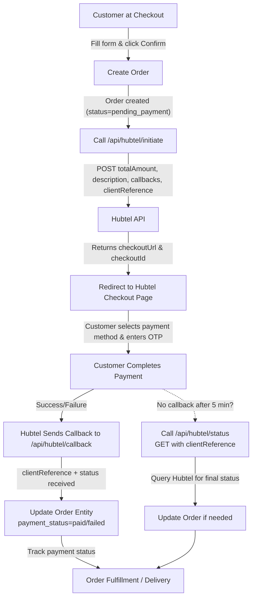
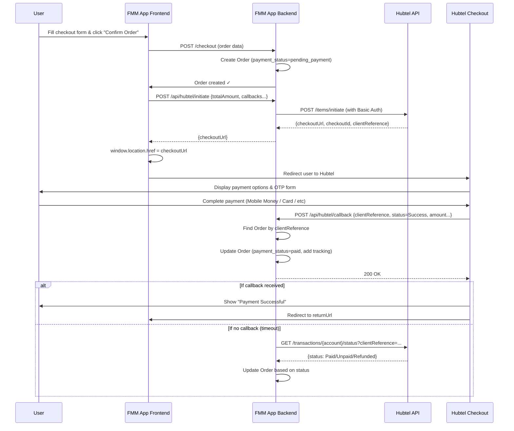

# Hubtel Payment Integration - UAT Guide & Flow Documentation

## Quick Flow Overview



## End-to-End Sequence Diagram



## API Endpoints

### 1. Payment Initiation

**Endpoint:** `POST /api/hubtel/initiate`

**Request Body:**
```json
{
  "totalAmount": 50.00,
  "description": "Order FMMP9V9Q",
  "callbackUrl": "https://app.example.com/api/hubtel/callback",
  "returnUrl": "https://app.example.com/orders/FMMP9V9Q?status=success",
  "cancellationUrl": "https://app.example.com/orders/FMMP9V9Q?status=cancelled",
  "clientReference": "FMMP9V9Q"
}
```

**Response (Success):**
```json
{
  "responseCode": "0000",
  "status": "Success",
  "data": {
    "checkoutUrl": "https://pay.hubtel.com/7569a11e8b784f21baa9443b3fce31ed",
    "checkoutId": "7569a11e8b784f21baa9443b3fce31ed",
    "clientReference": "FMMP9V9Q",
    "checkoutDirectUrl": "https://pay.hubtel.com/7569a11e8b784f21baa9443b3fce31ed/direct"
  }
}
```

### 2. Callback Handler

**Endpoint:** `POST /api/hubtel/callback`

**Callback Payload (from Hubtel):**
```json
{
  "ResponseCode": "0000",
  "Status": "Success",
  "Data": {
    "CheckoutId": "7569a11e8b784f21baa9443b3fce31ed",
    "SalesInvoiceId": "e96ccfb4746045bba13f425bd573a31c",
    "ClientReference": "FMMP9V9Q",
    "Status": "Success",
    "Amount": 50.00,
    "CustomerPhoneNumber": "233242825109",
    "PaymentDetails": {
      "MobileMoneyNumber": "233242825109",
      "PaymentType": "mobilemoney",
      "Channel": "mtn-gh"
    },
    "Description": "The MTN Mobile Money payment has been approved and processed successfully."
  }
}
```

**Response (Always 200):**
```json
{
  "message": "Callback processed successfully"
}
```

### 3. Transaction Status Check

**Endpoint:** `GET /api/hubtel/status?clientReference=FMMP9V9Q`

**Response (Paid):**
```json
{
  "message": "Successful",
  "responseCode": "0000",
  "data": {
    "date": "2026-06-22T12:30:00.000Z",
    "status": "Paid",
    "transactionId": "7fd01221faeb41469daec7b3561bddc5",
    "externalTransactionId": "0000006824852622",
    "paymentMethod": "mobilemoney",
    "clientReference": "FMMP9V9Q",
    "currencyCode": null,
    "amount": 50.00,
    "charges": 1.00,
    "amountAfterCharges": 49.00,
    "isFulfilled": null
  }
}
```

## Order Entity Updates

After payment callback is processed, the Order entity is updated:

```javascript
{
  "order_number": "FMMP9V9Q",
  "payment_status": "paid",  // Was: "pending_payment"
  "tracking_updates": [
    {
      "status": "Order Placed",
      "message": "Order created and waiting for payment confirmation.",
      "timestamp": "2026-06-22T12:00:00.000Z"
    },
    {
      "status": "Payment Success",
      "message": "Hubtel callback received. Status: Success. Amount: 50.00. Method: mobilemoney",
      "timestamp": "2026-06-22T12:05:00.000Z",
      "checkoutId": "7569a11e8b784f21baa9443b3fce31ed"
    }
  ]
}
```

## Testing Checklist

### Pre-Test Setup
- [ ] Hubtel credentials configured in environment:
  - `HUBTEL_API_KEY`
  - `HUBTEL_MERCHANT_ACCOUNT_NUMBER`
  - `HUBTEL_AP_ID`
- [ ] App public IP whitelisted with Hubtel for status checks
- [ ] Base44 server token set in environment (`BASE44_SERVER_TOKEN`)

### Test Scenarios

#### Scenario 1: Successful Mobile Money Payment
1. [ ] Add products to cart
2. [ ] Go to Checkout
3. [ ] Fill in delivery details
4. [ ] Click "Confirm Order"
5. [ ] Order is created in database
6. [ ] Redirected to Hubtel checkout page
7. [ ] Select "Mobile Money" payment method
8. [ ] Enter test phone number (e.g., 0244123456)
9. [ ] Complete OTP verification
10. [ ] Payment succeeds
11. [ ] Hubtel redirects back to returnUrl
12. [ ] Check Order entity: `payment_status` should be `paid`
13. [ ] Tracking updates include callback info

#### Scenario 2: Callback Fallback (Status Check)
1. [ ] Simulate callback delay (e.g., don't send callback)
2. [ ] After order is created, call `/api/hubtel/status?clientReference=FMMP9V9Q`
3. [ ] Response should show current status from Hubtel
4. [ ] Backend should update Order based on status

#### Scenario 3: Payment Failure
1. [ ] Complete checkout flow
2. [ ] At Hubtel checkout, cancel payment (enter wrong PIN, etc.)
3. [ ] Hubtel redirects to cancellationUrl
4. [ ] Callback with `Status: Failed` or `Status: Cancelled`
5. [ ] Order `payment_status` updated to `failed` or `cancelled`

#### Scenario 4: Concurrent Orders
1. [ ] Create 3-5 orders in quick succession
2. [ ] Verify each has unique `clientReference` (order_number)
3. [ ] Complete payments for all
4. [ ] Each order should update correctly with own payment status

### Manual Testing with curl

**Initiate Payment:**
```bash
curl -X POST http://localhost:5173/api/hubtel/initiate \
  -H "Content-Type: application/json" \
  -d '{
    "totalAmount": 50.00,
    "description": "Test Order",
    "callbackUrl": "https://app.example.com/api/hubtel/callback",
    "returnUrl": "https://app.example.com/orders/TEST001",
    "cancellationUrl": "https://app.example.com/orders/TEST001",
    "clientReference": "TEST001"
  }'
```

**Check Status:**
```bash
curl "http://localhost:5173/api/hubtel/status?clientReference=TEST001"
```

**Simulate Callback:**
```bash
curl -X POST http://localhost:5173/api/hubtel/callback \
  -H "Content-Type: application/json" \
  -d '{
    "ResponseCode": "0000",
    "Status": "Success",
    "Data": {
      "CheckoutId": "test123",
      "ClientReference": "TEST001",
      "Status": "Success",
      "Amount": 50.00,
      "CustomerPhoneNumber": "233242825109",
      "PaymentDetails": {
        "PaymentType": "mobilemoney",
        "Channel": "mtn-gh"
      }
    }
  }'
```

## Logging & Monitoring

All transactions are logged with prefixes for easy filtering:
- `[Hubtel Init]` - Payment initiation requests
- `[Hubtel Callback]` - Webhook callbacks
- `[Hubtel Status]` - Status check queries

Sample logs:
```
[Hubtel Init] Initiating payment for FMMP9V9Q: amount=50.00
[Hubtel Init] Success: FMMP9V9Q → 7569a11e8b784f21baa9443b3fce31ed
[Hubtel Callback] Received: {...}
[Hubtel Callback] Updated order FMMP9V9Q to payment_status=paid
[Hubtel Status] Checked FMMP9V9Q: status=Paid, http=200
```

## UAT Deliverables

### 1. Sample Callback Payloads
Collect from `/api/hubtel/uat-samples` endpoint after running tests:
- At least 1 successful payment callback
- At least 1 failed payment callback
- At least 1 cancelled payment callback

### 2. Sample Transaction Status Check Responses
From `/api/hubtel/status` after 5-minute timeout scenario:
- Paid status response
- Unpaid status response (if testable)
- Refunded status response (if applicable)

### 3. App Flow Diagram
Use the sequence diagrams in this document or create visual PPT/PDF showing:
- Customer → App → Hubtel → Callback → Order Update

### 4. Live App Link
Provide URL when app is deployed and ready for Hubtel's end-to-end testing.

### 5. Error Scenarios
Document any error handling:
- Network timeouts
- Invalid API key responses
- Mismatched merchant account numbers
- Callback retry behavior

## Troubleshooting

### Initiate Returns 4070 (Fees Not Set)
- Ensure `HUBTEL_MERCHANT_ACCOUNT_NUMBER` is correct
- Contact Hubtel support to confirm fees are configured

### Callback Not Received
- Verify callback URL is publicly accessible
- Check app logs for errors
- Call `/api/hubtel/status?clientReference=...` as fallback after 5 min

### IP Whitelisting Issues
- Status check returns 403 Forbidden
- Submit app's public IP(s) to Hubtel support

### Order Not Updating
- Verify Base44 server token is set correctly
- Check server logs for Base44 SDK errors
- Ensure Order entity has `order_number` field for lookup

## Next Steps

1. Configure environment variables in Base44
2. Deploy server functions to Base44
3. Whitelist IP with Hubtel
4. Run UAT test scenarios
5. Collect sample payloads and responses
6. Create PPT/PDF flow document with team
7. Schedule UAT meeting with Hubtel
8. Go live!
